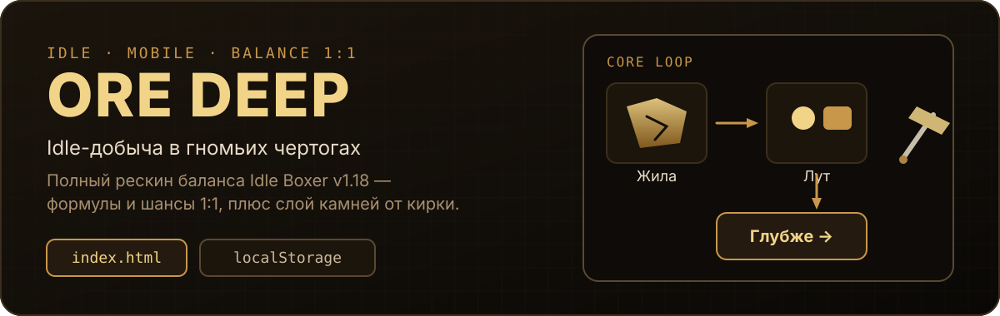
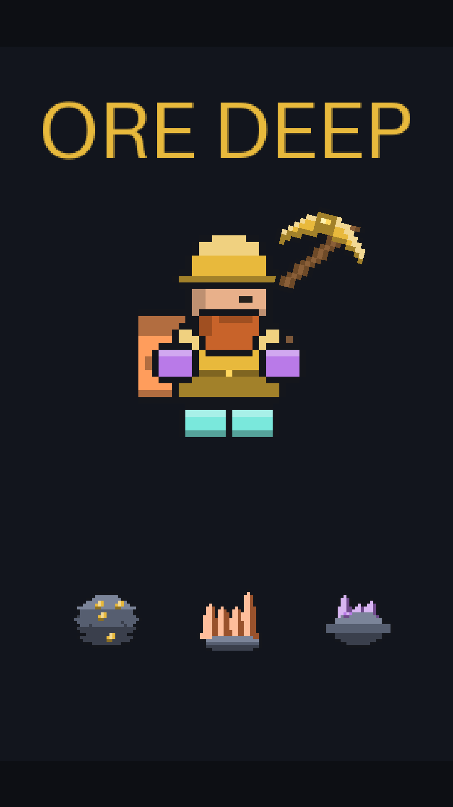
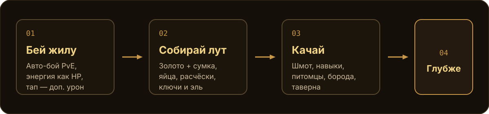
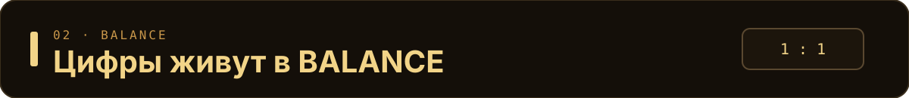
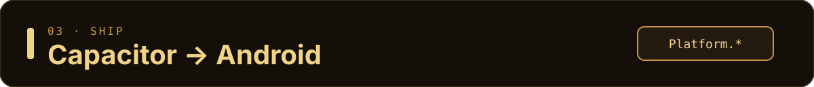

# ORE DEEP

<p align="center">
  
</p>

<p align="center">
  
</p>

**Idle / incremental RPG про дворфа-рудокопа.** Полный рескин баланса `com.tapnine.idleboxer` v1.18: формулы, кривые и шансы — **1:1** из реверса байткода. Единственное техническое отличие — слой редких камней от кирки.

| | |
|---|---|
| Играть | открыть [`index.html`](./index.html) в браузере |
| Прогресс | `localStorage` |
| Стек | один файл + Capacitor (Android) |
| Версия | `0.12.0` |

---

<p align="center">
  
</p>

## Что внутри прототипа

- Кривая породы (якоря + `growthLerp`) и ограниченный прогон `BALANCE.run.len`
- Сумка находок, 8 слотов шмота, Auto Roll, камни от кирки
- Питомцы / старейшины (merge, восхождение), навыки + эль, престиж «Глубинный Зов»
- Таверна, рынок, PvP-заготовка, гильдия Рудознатцев (разметка глазом, не майнинг)
- Детерминированный бой, оффлайн-доход, таймеры

Числа с пометкой `CALIB` в коде — «≈» из GDD, калибруются плейтестами.

Подробности механик и сверка с доком — в [`docs/`](./docs/) и [`AGENTS.md`](./AGENTS.md).

---

<p align="center">
  
</p>

```bash
# в корне репозитория
open index.html          # macOS
# или любой статический сервер, например:
python3 -m http.server 8788
# → http://127.0.0.1:8788/index.html
```

Всё в одном `<script>`: CSS + HTML + логика. Сборщика нет — это осознанный прототип.

---

<p align="center">
  
</p>

Баланс — **исполняемый**: константы только в `BALANCE` / `DEPTH` / `UPGRADES` / якорях. Равновесие треадмилла:

```text
escPerBlock = ATK_COMPOUND ^ atkLevelsPerBlock()
```

Ломается равенство → ваншот или стена. Правила правки — [`.claude/rules/balance-constants.md`](./.claude/rules/balance-constants.md).

```bash
node tools/run_tests.js        # функциональные тесты (0 FAIL)
node tools/calibrate_atk.js    # сек/жилу по глубинам, лог-сигма
node tools/balance_sim.js      # Монте-Карло прогрессии
node tools/audit_buttons.js    # привязка кнопок
```

Прогон ограничен: пик HP читаем без `e92`, дальше только престиж (сила в **уровне**, не в экспоненте).

---

<p align="center">
  
</p>

```bash
npm install && npm run sync && npx cap open android
npm run art    # пиксель-арт → art/*.png → base64 в index.html
npm run aab    # release AAB для Google Play (нужен Android SDK + keystore)
```

Полный чеклист заливки в стор: [`docs/STORE_ANDROID.md`](./docs/STORE_ANDROID.md).

Нативные SDK идут через `Platform` в `index.html` (web-стабы → AdMob / Firebase / Billing в сборке).

| Метод | Назначение |
|---|---|
| `Platform.logEvent` | аналитика |
| `Platform.showRewarded` | rewarded ads |
| `Platform.buy` | IAP |

Иконка / сплеш: [`resources/`](./resources/). Арт собственный (`tools/gen_pixel_art.py`).

---

## Карта репозитория

| Путь | Зачем |
|---|---|
| `index.html` | играбельный core loop |
| `tools/` | тесты, калибратор, арт, UI-скрины |
| `docs/` | GDD / ТЗ / сверка / роадмап |
| `.claude/` | economy-designer, balance-check, pre-commit хук |
| `assets/readme/` | визуалы этой страницы |

---

## Лицензия и происхождение баланса

Балансовые числа — реверс публичного клиента Idle Boxer (см. `docs/REVERSE_ECONOMY.md`). Контур `.claude/` частично из [Claude Code Game Studios](https://github.com/Donchitos/Claude-Code-Game-Studios) (MIT); список правок — [`.claude/THIRD_PARTY.md`](./.claude/THIRD_PARTY.md).
